# 🎮 Adaptive Multi-Agent Educational Game Generator

**Transform any textbook content into interactive HTML5 games using AI-powered multi-agent systems**

[](https://python.org)
[](https://github.com/geekan/MetaGPT)
[](LICENSE)

## 🌟 What This Does

This system analyzes educational content and automatically generates the **perfect number** of interactive games needed to teach it completely. No more guessing - pure AI-driven educational design!

## 🚀 Key Features

- 🧠 **AI Content Analysis** - Determines optimal learning structure automatically
- 🎯 **Adaptive Game Count** - 3-15 games based on content complexity  
- 🎮 **Complete HTML5 Games** - Self-contained, mobile-responsive educational games
- 📊 **Learning Analytics** - Detailed educational insights and progress tracking
- 🤖 **Multi-Agent Architecture** - Specialized AI agents working together
- 🚀 **Zero Dependencies** - Games work anywhere, no external files needed
- ⚡ **Fast Generation** - Complete learning portal in minutes

## 📋 Prerequisites

```bash
# Check Python version (3.8+ required)
python --version

# Install Git if needed
git --version
```

## 🚀 Quick Start

### 1. Clone & Setup

```bash
# Clone this repository
git clone https://github.com/arjunthilak05/multiagentcode.git
cd multiagentcode

# Clone MetaGPT framework (required dependency)
git clone https://github.com/geekan/MetaGPT.git
cd MetaGPT
pip install -e .
cd ..
```

### 2. Install Dependencies

```bash
# Core dependencies
pip install metagpt openai

# Additional requirements for multi-agent features
pip install langgraph langchain
```

### 3. Configure API

Edit `MetaGPT/config/config2.yaml`:

```yaml
llm:
  api_type: "openai"
  model: "x-ai/grok-4-fast:free"  # Free tier available!
  base_url: "https://openrouter.ai/api/v1"
  api_key: "YOUR_API_KEY_HERE"    # Get from https://openrouter.ai
```

**Get Free API Key:**
1. Visit [OpenRouter.ai](https://openrouter.ai) 
2. Sign up (free tier available)
3. Copy API key to config above

### 4. Run the System

```bash
# Add your educational content
echo "Your textbook content here..." > "MetaGPT/extract (1).txt"

# Generate adaptive games
cd MetaGPT
python adaptive_game_generator.py

# Open the learning portal
open adaptive_games/index.html
```

## 🎮 Usage Examples

### Basic Game Generation

```bash
# Simple content example
echo "Geometry: Learn about triangles, squares, and circles." > "MetaGPT/extract (1).txt"

# Run the adaptive system
cd MetaGPT
python adaptive_game_generator.py

# Result: 3-5 games automatically generated!
```

### Advanced Usage

```python
from MetaGPT.adaptive_game_generator import AdaptiveGameSystem

# Initialize system
system = AdaptiveGameSystem()

# Generate games from your content
await system.generate_adaptive_games(
    content_file="extract (1).txt",
    output_dir="my_custom_games"
)
```

### Multi-Agent System (MetaGPT Framework)

```bash
# Run the proper MetaGPT multi-agent version
cd MetaGPT
python multi_agent_game_system.py \
  --content_file="extract (1).txt" \
  --output_dir="multi_agent_games" \
  --n_rounds=4
```

### Testing the System

```bash
# Test core functionality
python test_stations.py

# Test automation features  
python test_automated_swarm.py

# Demo the complete system
python demo_automated_system.py
```

## 🏗️ System Architecture

### Multi-Agent Pipeline

```mermaid
graph LR
    A[📄 Content File] --> B[🔍 AI Analysis]
    B --> C[🎯 Game Planning]
    C --> D[🎮 Game Generation]
    D --> E[🌐 Learning Portal]
```



### Core Components

```python
AdaptiveGameSystem           # 🎯 Main orchestrator
├── AdaptiveContentAnalyzer  # 🔍 AI content analysis  
├── EnhancedGameGenerator    # 🎮 AI game creation
└── FixedCodeCleaner        # 🧹 HTML validation
```

### Key Features

- **Content Analysis**: AI determines optimal learning structure
- **Adaptive Planning**: Dynamic game count (3-15) based on complexity
- **Game Generation**: Complete HTML5 games with embedded CSS/JS
- **Quality Assurance**: Multi-layer validation and error recovery
- **Portal Creation**: Beautiful learning dashboard with analytics

## 🎯 Sample Results

### Input: Grade 6 Geometry Patterns
```
Content: "Patterns in shapes, polygons, sequences..."
Length: 2,500 words
```

### AI Analysis Output:
```json
{
  "optimal_game_count": 10,
  "total_concepts": 7,
  "complexity_breakdown": {
    "simple": 2,
    "medium": 3, 
    "complex": 2
  },
  "estimated_learning_time": "60 minutes"
}
```

### Generated Games:
1. 🔍 **Shape Basics Explorer** (Very Easy)
2. 🔺 **Polygon Pattern Spotter** (Easy)  
3. 🏗️ **Next Polygon Builder** (Medium)
4. 🕸️ **Graph Connection Challenge** (Easy)
5. 🎯 **Connect the Dots Graph** (Medium)
6. 📦 **Square Stack Puzzle** (Easy)
7. 🏗️ **Build Bigger Squares** (Medium)
8. 🔺 **Triangle Stack Adventure** (Medium)
9. ❄️ **Snowflake Fractal Journey** (Hard)
10. 🧠 **Pattern Rule Master** (Very Hard)

## 📁 Project Structure

```
multiagentcode/
├── README.md                       # 📖 You are here!
├── automated_runner.py             # 🤖 Main automation orchestrator
├── station1_cli.py                # 🎮 Station 1 CLI
├── station2_cli.py                # 🎮 Station 2 CLI  
├── test_stations.py               # 🧪 System testing
├── test_automated_swarm.py        # 🧪 Automation testing
├── demo_automated_system.py       # 🎬 Demo system
└── MetaGPT/                       # 🎯 Core game generator
    ├── adaptive_game_generator.py  # 🎮 Main adaptive system
    ├── fixed_code_cleaner.py      # 🧹 HTML validator
    ├── multi_agent_game_system.py # 🤖 MetaGPT framework version
    ├── extract (1).txt            # 📖 Your content file
    ├── config/
    │   └── config2.yaml           # ⚙️ API configuration
    └── adaptive_games/            # 📁 Generated output
        ├── index.html             # 🌟 Learning portal
        ├── game_01_*.html         # 🎮 Individual games
        └── analysis_report.json   # 📊 Analytics
```

## 🔧 Configuration

### API Configuration

Edit `MetaGPT/config/config2.yaml`:

```yaml
llm:
  api_type: "openai"
  model: "x-ai/grok-4-fast:free"     # Free tier model
  base_url: "https://openrouter.ai/api/v1"
  api_key: "sk-or-v1-..."           # Your OpenRouter API key
```

### Supported Models
- `x-ai/grok-4-fast:free` (Recommended - free tier)
- `openai/gpt-4` (High quality, paid)
- `openai/gpt-3.5-turbo` (Fast, affordable)
- `anthropic/claude-3` (Alternative provider)

### System Settings
- **Content Analysis**: Automatic complexity detection
- **Game Count**: 3-15 games (auto-determined)  
- **Output Format**: HTML5 with embedded CSS/JS
- **Quality Assurance**: Multi-layer validation

## 🧪 Testing

### Run All Tests

```bash
python test_stations.py
```

### Test Individual Components

```bash
# Test automation
python test_automated_swarm.py

# Test demo system
python demo_automated_system.py

# Test individual stations
python station1_cli.py
python station2_cli.py
```

## 🤝 Contributing

1. Fork the repository
2. Create a feature branch (`git checkout -b feature/amazing-feature`)
3. Commit your changes (`git commit -m 'Add some amazing feature'`)
4. Push to the branch (`git push origin feature/amazing-feature`)
5. Open a Pull Request

## 📝 License

This project is licensed under the MIT License - see the [LICENSE](LICENSE) file for details.

## 🙏 Acknowledgments

- [MetaGPT](https://github.com/geekan/MetaGPT) - The multi-agent framework
- [LangGraph](https://github.com/langchain-ai/langgraph) - Agent coordination
- [OpenAI](https://openai.com/) - Language models

## 📞 Support

If you encounter any issues or have questions:

1. Check the [Issues](https://github.com/arjunthilak05/multiagentcode/issues) page
2. Create a new issue with detailed information
3. Include system information and error logs

## 🔄 Updates

Stay updated with the latest features and improvements:

```bash
git pull origin main
pip install -r MetaGPT/requirements.txt --upgrade
```

---

**Happy coding with multi-agent systems! 🚀**
